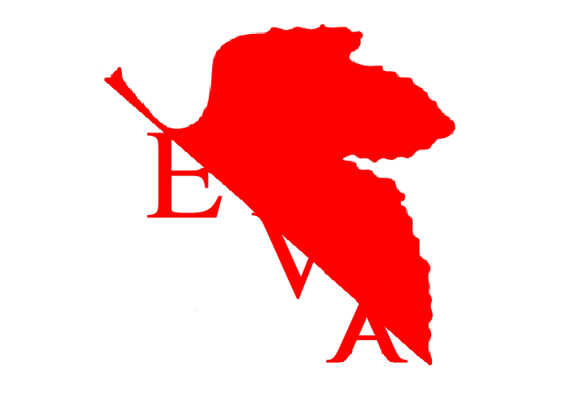

## ¿Quiénes somos?

Somos una startup comprometida con aportar algo nuevo a la saturada industria del cuidado de plantas.

### ¿Qué es E.V.A.?



E.V.A. es un producto comercial cuyo objetivo es la automatización del cuidado de las plantas. 

Sus siglas hacen referencia a: **Evaluación de Vegetación Automática**

### Funciones de E.V.A.

```markdown
Syntax highlighted code block

# Header 1
## Header 2
### Header 3

- Bulleted
- List

1. Numbered
2. List

**Bold** and _Italic_ and `Code` text

[Link](url) and 
```

For more details see [GitHub Flavored Markdown](https://guides.github.com/features/mastering-markdown/).

### Jekyll Themes

Your Pages site will use the layout and styles from the Jekyll theme you have selected in your [repository settings](https://github.com/Alvarikoke99/ProyectoEVA/settings). The name of this theme is saved in the Jekyll `_config.yml` configuration file.

### Support or Contact

Having trouble with Pages? Check out our [documentation](https://help.github.com/categories/github-pages-basics/) or [contact support](https://github.com/contact) and we’ll help you sort it out.
