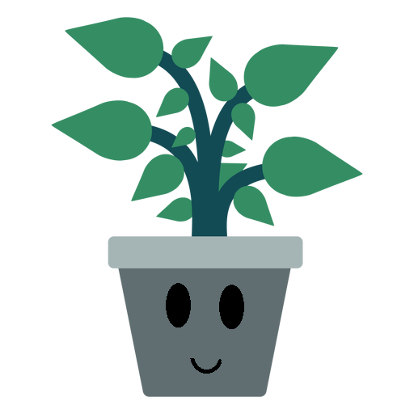

## ¿Quiénes somos?

Somos una startup comprometida con aportar algo nuevo a la saturada industria del cuidado de plantas.

### ¿Qué es E.V.A.?

* E.V.A. es un producto comercial cuyo objetivo es la automatización del cuidado de las plantas. 
* Sus siglas hacen referencia a: **Evaluación de Vegetación Automática**

### Funciones de E.V.A.

* La frecuencia de regado se controla en función de la situación actual de la planta 
* Hemos desarrollado una app de control con 2 modos diferentes
    * Modo básico con una mascota virtual
    * Modo avanzado con la posibilidad de modificar parámetros de control
* La app también sirve para monitorizar las lecturas de los diversos sensores
